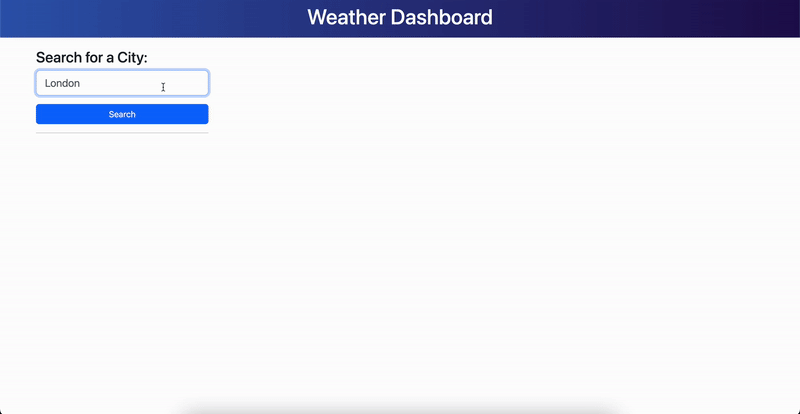
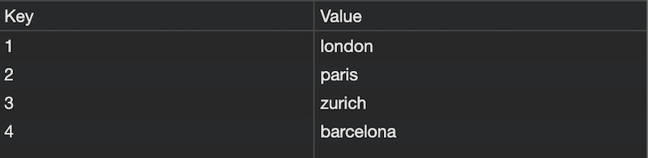

# Weather Dashboard

This Weather Dashboard is a web application that utilizes the OpenWeatherMap API to provide users with current weather conditions and a 5-day weather forecast for a specified city. The dashboard includes a user-friendly search form, allowing users to input the desired city and receive accurate and up-to-date weather information.

## Features

- **Search City Form:** Easily search for the weather details of any city by entering its name in the provided search form.
- **Current Weather:** Display the current weather condition, including temperature, wind speed and humidity.
- **5-Day Forecast:** Provide a 5-day weather forecast with details including temperature, wind speed and humidity.
- **LocalStorage Integration:** Save the last searched cities in LocalStorage, allowing users to quickly access weather information for their preferred location upon returning to the dashboard.

## Technologies Used

- **Frontend:** HTML, CSS, Bootstrap and JavaScript
- **Libraries** Day.js and jQuery
- **API** OpenWeatherMap API 
- **Version Control:** Git

## Screenshots

## Link to Project

The live version of this project can be found [here](https://caseygirlyn.github.io/Weather-Dashboard/).

## License

This project is licensed under the [MIT License](LICENSE).

## Acknowledgments
Special thanks to the [OpenWeatherMap](https://openweathermap.org/) team for providing the weather data API.